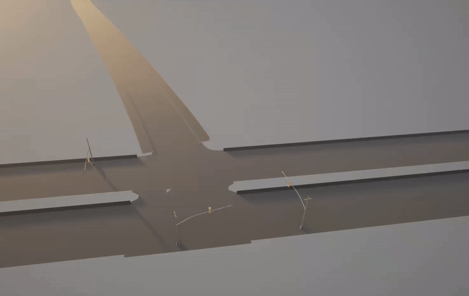
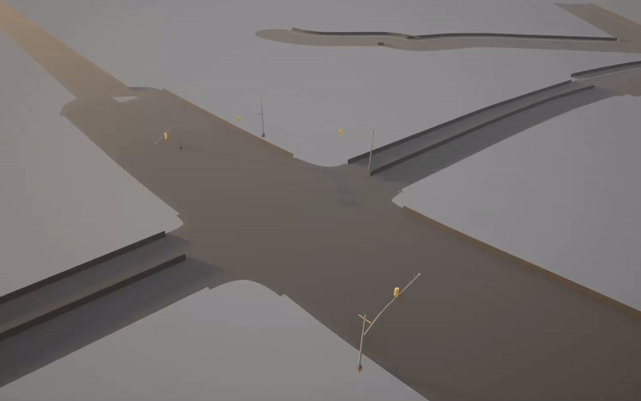
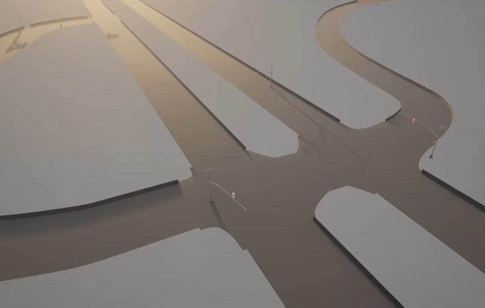
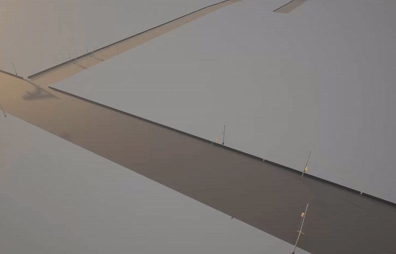
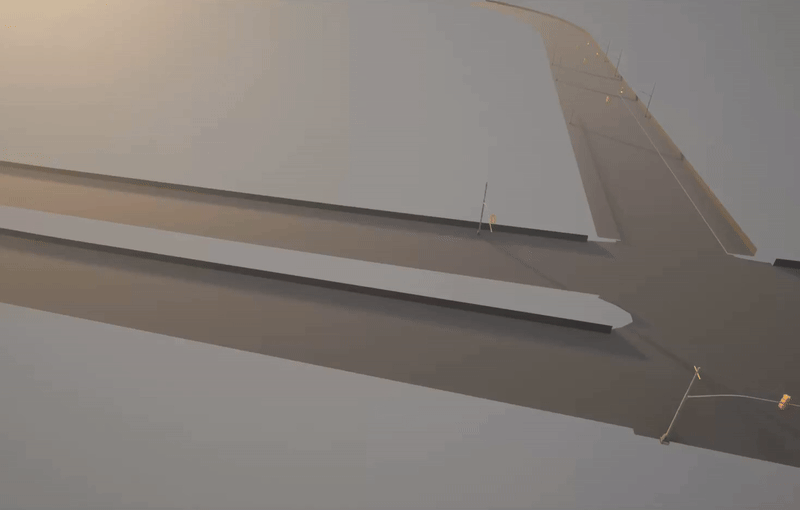
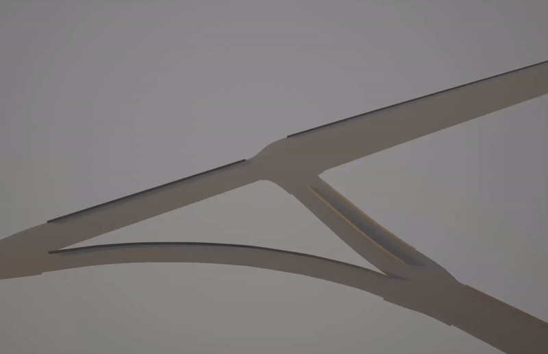

| | | |
|:---:|:---:|:---:|
|  |  |  |
|  |  |  |

# CARLA Crash Scenario Reconstruction and Benchmark

This project provides a complete pipeline for reconstructing real-world traffic crash scenarios from the [NHTSA Crash Viewer](https://crashviewer.nhtsa.dot.gov/CrashAPI) and simulating them in the [CARLA Simulator](https://carla.org/). It includes tools for processing crash reports, generating maps, creating simulation scenarios, and running the resulting benchmarks.


## Project Structure

The repository is divided into two main components:

*   **`Reconstruction-Pipeline/`**: A Dockerized environment containing all the scripts and tools necessary to process raw crash data (in XML format) and convert it into a runnable CARLA scenario. This pipeline:
    *   Parses NHTSA crash reports.
    *   Generates CARLA-compatible maps (`.xodr`) from OpenStreetMap data corresponding to the crash location.
    *   Leverages a Large Language Model (Google Gemini) to interpret the crash summary and determine initial vehicle states (position, speed, direction).
    *   Outputs simulation files (`.json`) that define the scenario.

*   **`Benchmark/`**: Contains the pre-generated outputs of the `Reconstruction-Pipeline`. This directory serves as a collection of ready-to-run crash scenarios. It is structured as follows:
    *   `reports/`: The original XML crash reports from NHTSA.
    *   `summary/`: Text summaries of the crash reports.
    *   `maps/`: The `.xodr` map files for each scenario.
    *   `simulations/`: The `.json` files defining the vehicle trajectories and events for the simulation.


## Getting Started

### Prerequisites

Before you begin, ensure your host machine meets the following requirements:

1.  **Docker Engine:** [Installation Guide](https://docs.docker.com/engine/install/)
2.  **NVIDIA GPU:** A dedicated NVIDIA graphics card is required for running the CARLA simulator.
3.  **NVIDIA Graphics Drivers:** The latest proprietary NVIDIA drivers for your GPU.
4.  **NVIDIA Container Toolkit:** To enable GPU access within Docker. [Installation Guide](https://docs.nvidia.com/datacenter/cloud-native/container-toolkit/latest/install-guide.html)
5.  **X11 Server:** To display the CARLA simulator GUI from within the container.
6.  **Google Gemini API Key:** Required for the reconstruction pipeline to generate scenarios.

### Installation

Clone the repository to your local machine:
```sh
git clone https://github.com/NahianSalsabil/carla-benchmark.git
cd carla-benchmark
```

## How to Run a Benchmark Demo

The `Benchmark/` directory contains scenarios that are ready to be simulated. For detailed instructions on how to set up the environment and run a pre-existing scenario, please refer to the [`Benchmark/README.md`](Benchmark/README.md).

## How to Use the Reconstruction Pipeline

The `Reconstruction-Pipeline/` contains all the tools to generate new scenarios from raw NHTSA crash reports. For detailed instructions on building the required Docker environment and using the scripts to generate a new scenario, please see the [`Reconstruction-Pipeline/README.md`](Reconstruction-Pipeline/README.md).

## Dependencies

The core dependencies are managed within the Dockerfile. Key components include:

*   **CARLA Simulator:** Version 0.9.15
*   **Python:** Version 3.8
*   **Python Libraries:** `numpy`, `pandas`, `pyproj`, `shapely`, `carla`, `google-generativeai`, `lxml`, and more listed in `Reconstruction-Pipeline/requirements.txt`.

## Comparison of Recent Crash Reconstruction Frameworks

| Factor | **[TRACE (Ours)](https://github.com/NahianSalsabil/carla-benchmark)** | [CrashAgent](https://arxiv.org/abs/2505.18341) | [SAFE](https://arxiv.org/abs/2502.02025) | [AC3R](https://github.com/SoftLegend/AC3R-Demo) | [AccidentSim](https://accidentsim.github.io/) | [SoVAR](https://github.com/meng2180/SoVAR) |
| :--- | :--- | :--- | :--- | :--- | :--- | :--- |
| **Open Source** | ✅ Yes (Code + Benchmark) | ❌ No (Dataset only) | ✅ Yes | ✅ Yes | ❌ No | ✅ Yes |
| **Crash Data Source** | NHTSA XML Reports | NHTSA CISS | NHTSA CIREN | NHTSA Police Reports | NHTSA Physical Parameters | NHTSA Crash Reports |
| **Spatial Context Source** | ✅ GPS coordinates → **automated** real-world OSM map retrieval | Hand-drawn crash sketch diagrams | Hand-drawn crash sketch diagrams | Text narrative only | Manual physical measurements | Text narrative only |
| **Map Construction** | ✅ **Fully automated** — zero manual effort | Semi-automated from sketches | Synthetic template-based DSL | Abstract / generic geometry | ⚠️ **Manual** 3D modeling (RoadRunner, per scenario) | Generalizable template-based roads |
| **Realism of Road Topology** | ✅ **High** (site-specific real-world geometry) | Moderate (sketch-reconstructed) | Moderate (synthetic templates) | Low (abstract geometry) | High (visual fidelity, manual) | Moderate (generic templates) |
| **Supported Topologies** | Straight, Curve, T-intersection, 4-way intersection | Roads, Intersections, Interchanges | Straight, Curve, T, Intersection, Merging | Straight, Curvy, 2-way, T-junction | Intersection, T-junction, Circular, Y-junction | Straight, T-junction, Intersection |
| **Reconstruction Pipeline** | ✅ LLM state estimation + automated OSM pipeline | Multi-modal VLM agents | RAG + DSL + CoT reasoning | NLP + Ontology + Kinematics | Fine-tuned LLM + ⚠️ manual 3D scene setup | LLM extraction + Z3 Constraint Solver |
| **Collision Types** | ✅ **Any** (unconstrained) | Fixed set (~5 types) | Fixed set (3 types) | Fixed set (4 types) | Fixed set (5 types) | Fixed set (3 types) |
| **Vehicle Maneuvers** | ✅ **Any** (LLM-inferred) | 42 predefined elements | Move Forward, Turn Left, Turn Right | Basic pre-crash actions from ontology | Pre/post-collision planned set | Regular (U-turn, lane change) & Abnormal |
| **Collision Validation** | ✅ **3-dimensional**: impact points + maneuvers + location | Single-dimensional: geometric distance optimization | Single-dimensional: LLM self-consistency check | Single-dimensional: damaged component matching | Single-dimensional: physics trajectory error | Single-dimensional: collision area constraint |
| **Primary Simulator** | ✅ **CARLA** (industry standard) | CARLA | MetaDrive & BeamNG | BeamNG.research | CARLA | LGSVL ⚠️ (discontinued) |

---

### Table Highlights
*   **TRACE** is fully open-source, unlike CrashAgent and AccidentSim. This makes it one of the high-topology-fidelity frameworks that the research community can freely use, inspect, and extend.
*   **TRACE** automatically retrieves **real-world OpenStreetMap data** for the exact crash coordinates, guaranteeing that the simulated road geometry matches the actual accident site. AccidentSim achieves comparable visual fidelity but requires expensive, manual RoadRunner 3D modelling for every scenario — making it impractical at scale.
*   Unlike AC3R and SoVAR, that work purely from text narratives, or CrashAgent and SAFE, which depend on hand-drawn sketch diagrams, **TRACE** derives spatial context programmatically from **GPS coordinates embedded in the crash report** — removing the need for any manual map construction or diagram interpretation.
*   **TRACE** combines **LLM-based state estimation** with a fully automated **OSM map pipeline**, a methodology not replicated by any other framework. This allows the LLM to reason about vehicle behavior within a geospatially accurate environment rather than an abstract or sketch-derived one.
*   **TRACE** validates reconstructions by simultaneously checking **impact points, vehicle maneuvers, and crash location**, making its ground-truth alignment more comprehensive than frameworks that check only component damage (AC3R), optimize textual descriptions (CrashAgent), or constrain collision areas geometrically (SoVAR).
*   **TRACE** targets **CARLA**, the most widely adopted open autonomous-driving simulator, ensuring broad hardware compatibility and access to a large existing ecosystem of sensors, agents, and evaluation tools — an advantage over frameworks using BeamNG, MetaDrive, or the discontinued LGSVL.
*   The current benchmark took a sample of **100 crash reports** from NHTSA, which naturally skew toward the most common US crash topologies (straight roads, curves, T-intersections, and 4-way intersections). Less frequent topologies such as Y-intersections, L-shaped curves, and roundabouts were not represented in this sample. Among all compared frameworks, only AccidentSim supports Y-junction and circular topologies — however, it achieves this through manual 3D road modeling in RoadRunner, which does not scale to large datasets. Extending **TRACE** to these road types through automated OSM extraction is planned as future work.